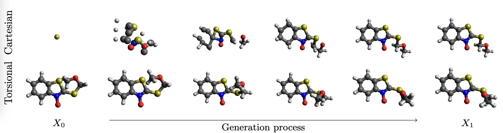

# Adjoint Sampling - Lennard-Jones

Inoffical patch of [adjoint sampling](https://github.com/facebookresearch/adjoint_sampling) to include the Lennard-Jones potential, first introduced as a benchmark in [Equivariant Flows: Exact Likelihood Generative Learning for Symmetric Densities](https://github.com/noegroup/bgflow/blob/main/bgflow/distribution/energy/lennard_jones.py).
Note that the implementation might differ by +-1 or +-1/2 from the formula in the adjoint sampling paper or their unpublished code.

Quickstart
```bash
git clone git@github.com:BurgerAndreas/adjoint_sampling_lj.git
cd adjoint_sampling_lj

micromamba env create -f environment.yml
micromamba activate adjoint_sampling_lj

python train.py experiment=lennard_jones

# python cache_dataset.py
# python train.py experiment=spice_cartesian_small
```


---

# Adjoint Sampling

This repository contains the official implementation and experiments for Adjoint Sampling: Highly Scalable Diffusion
Samplers via Adjoint Matching.

Adjoint Sampling is a highly scalable diffusion-based sampling framework that learns to sample from unnormalized densities without any reference data. Adjoint Sampling is scalable with respect to the complexity of both the generative model and the energy function, allowing the use of state-of-the-art neural energy functions.

**[Arxiv](https://arxiv.org/abs/2504.11713) (Accepted in ICML 2025)**  
*Authors: _Aaron Havens, Benjamin Kurt Miller, Bing Yan, Carles Domingo-Enrich, Anuroop Sriram, Brandon Wood, Daniel Levine, Bin Hu, Brandon Amos, Brian Karrer, Xiang Fu, Guan-Horng Liu, Ricky T. Q. Chen_*



We evaluate Adjoint Sampling on a new amortized conformer generation task using eSEN energy function and SPICE: A large-scale dataset of organic, drug-like molecules that provides molecular graph information—including atomic species and bond structure.

## Installation

Install dependencies.
```bash
micromamba env create -f environment.yml
micromamba activate adjoint_sampling
```

To train against an energy model, you will need the [eSEN](https://arxiv.org/abs/2502.12147) checkpoint in our [Hugging Face repository](https://huggingface.co/facebook/adjoint_sampling). This will download automatically as you run the code, as long as you provide the `huggingface-cli` with a [token](https://huggingface.co/settings/tokens). You must first [apply for access to the repo](https://huggingface.co/facebook/adjoint_sampling) before the token will work.
```bash
huggingface-cli login
```

## Data

The molecules are organized into rows in `data/{drugs_test,spice_test,spice_train}.txt` with three columns: Number of rotatable bonds, SMILES string, and hash. Finding the [CREST](https://github.com/crest-lab/crest) conformers for a molecule requires the hash. For a `{drugs,spice}` molecule with a `${hash}`, the conformers are written as concatenated `.xyz` blocks in a single text file below the directory `data/{drugs,spice}_test_conformers/${hash}`.

The conformers in `drugs` are from [GEOM](https://github.com/learningmatter-mit/geom). The conformers in `spice` were computed by FAIR Chemistry.

## Models

All of our models are hosted on [Hugging Face](https://huggingface.co/facebook/adjoint_sampling). We provide a script to download the files to local directory `models`. Downloading models requires you to have a [token](https://huggingface.co/settings/tokens). You must first [apply for access to the repo](https://huggingface.co/facebook/adjoint_sampling) before downloading.

```bash
python download_models.py
```

Once the models are downloaded, you can copy the path for use in evaluation or for your own projects. The checkpoints can be identified:
```
Cartesian AdjSampling             -   models/am/checkpoints/checkpoint_4999.pt
Cartesian AdjSampling (+pretrain) -   models/bmam/checkpoints/checkpoint_4999.pt
Torsional AdjSampling             -   models/torsion/checkpoints/checkpoint_3000.pt

Pretrained Cartesian              -   pretrain_for_bmam/checkpoints/checkpoint_2000.pt
```
We provide `Pretrained Cartesian` for the purposes of training `Cartesian AdjSampling (+pretrain)`.


## Training on the SPICE datset

We trained each model using 8 gpus over 72 hours. These commands will train the corresponding model.

Run the following commands on a single node with many cpus **before** starting training! The second one is only necessary if you would like to train the Torsional AdjSampling model.
```bash
python cache_dataset.py
python cache_dataset.py --learn_torsions
```

Our repository allows distributed training where shared files are put into a shared directory, known in the config as `shared_dir`. It is set as `/home/${oc.env:USER}` by default. It evaluates to `/home/${USER}` for training due to [hydra](https://hydra.cc/docs/intro/)'s variable expansion syntax.

##### Cartesian AdjSampling
```bash
python train.py experiment=spice_cartesian
```

##### Cartesian AdjSampling (+pretrain)

This model requires sequential training. first you must train the "pretrained" model using the first command. Then, you need to direct the second model to initialize from the first model with `init_model=...` pointing to the initial checkpoint. No error is raised if you fail to point to an `init_model`, but the model will not be pretrained.

```bash
python train.py experiment=spice_cartesian_pretrain_for_bmam
python train.py experiment=spice_cartesian_bmam init_model=???
```

##### Torsional AdjSampling
```bash
python train.py experiment=spice_torsion
```


## Evaluation
To evaluate the trained model, use `eval.py`. Reported results set `max_n_refs` to 512.

```bash
python eval.py \
--test_mols data/spice_test.txt \
--true_confs data/spice_test_conformers \
--save_path results \
--checkpoint_path path/to/checkpoint.pt \
--max_n_refs 512
```

It is possible to evaluate in a distributed manner as well, check out `eval_distributed.sh`.


## 📚 Citation

If you find this code useful in your research or projects, please consider citing our research paper:

```bibtex
@article{adjoint_sampling,
  title={{A}djoint {S}ampling: Highly Scalable Diffusion Samplers via {A}djoint {M}atching},
  author={Havens, Aaron and Miller, Benjamin Kurt and Yan, Bing and Domingo-Enrich, Carles and Sriram, Anuroop and Wood, Brandon and Levine, Daniel and Hu, Bin and Amos, Brandon and Karrer, Brian and Fu, Xiang and Liu, Guan-Horng and Chen, Ricky T. Q.},
  journal={International Conference on Machine Learning},
  year={2025}
}
```

## License
This repository is licensed under the
[CC BY-NC 4.0 License](https://creativecommons.org/licenses/by-nc/4.0/).

### Notice
The majority of Adjoint Sampling is licensed under CC-BY-NC, however portions of the project are available under separate license terms: [DEM](https://github.com/jarridrb/DEM), [EGNN](https://github.com/vgsatorras/egnn), [torsional-diffusion](https://github.com/gcorso/torsional-diffusion), [fairchem](https://github.com/FAIR-Chem/fairchem) are licensed under the MIT license. [SPICE](https://github.com/openmm/spice-dataset) and [GEOM](https://github.com/learningmatter-mit/geom) are licensed under the CC0 license.
